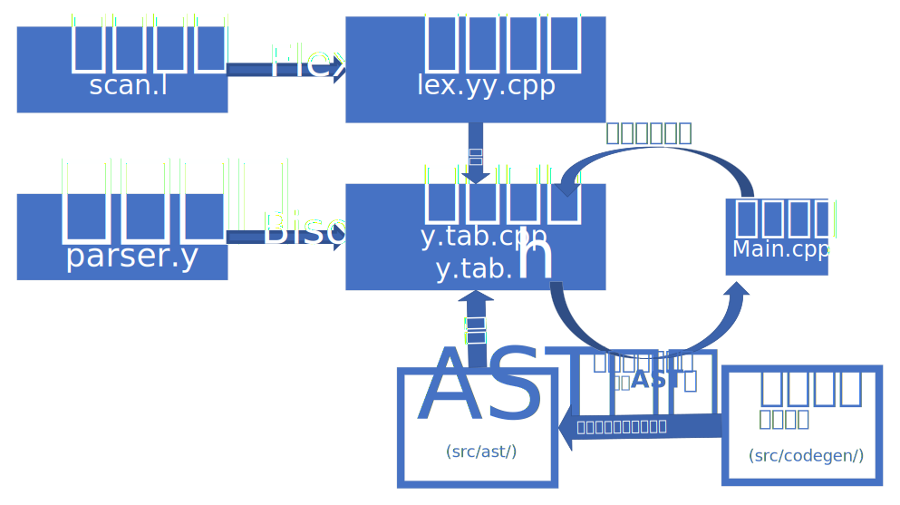

# Simple S-Pascal Compiler 课程报告
## 需求分析
### 源语言说明
我们实现的是Pascal-S语言的编译器,Pascal-S是Pascal语言的一个子集,相对来说减少了很多功能.但是在实际上,很难找到Pascal-S的标准编译器,所以在实现语法时,我们基本借鉴的是标准的Pascal语言,包括Set和一些Pascal内置的系统函数.但是,因为能力有限,在实际的编译实现中,我们没能实现SET等一些高级数据结构.因为这样势必在代码中插入大量的运行时代码,这远在我们能力之外.

并且,对于Pascal类语言的嵌套函数定义,我们也没能实现.我们确实有思路,但是因为能力问题,实现的嵌套定义后出现了很多bug,我们无力解决,只得放弃.

### 目标语言语法说明

课程设计要求中,我们编译器要输出的是对应平台的汇编代码.借助LLVM优秀的跨平台特性,我们支持几乎所有平台(包括x86-64,ARM,MIPS等)的汇编形式.

但是因为程序要进行输入输出时势必与操作系统完成交互,因此目前只支持在LLVM工具链的平台上运行.但是生成汇编平台是任意的.比如,我们可以生成运行在AMD GPU的汇编代码,但是因为GPU上显然不能实现基本输入输出,所以运行时无法进行交互.

### 功能描述

我们的程序在读入Pascal源代码后,可以生成解析后的AST语法树,以及对应的LLVM IR,或者当前平台的ASM汇编,或者编译完成的OBJ文件.

同时,为了提高运行效率,我们的编译器提供了一些代码优化(基于LLVM库).在编译器运行时传入优化选项,我们的编译器支持如下优化措施:

* 寄存器分配优化
* 指令合并
* 指令重排
* 冗余代码移除
* 常量合并
* 函数内联

另外,因为在程序进行输入输出时,必须与操作系统调用,这里我们采取的时依赖对应平台的C语言标准库,所以若想运行编译器生成的文件,一定要通过此平台自带的链接器完成链接,或者通过LLVM的lli工具解释执行生成的LLVM IR代码.

### 使用的工具(依赖)

我们的编译器支持在类Unix平台下运行(Windows其实也可以,但配置起来十分繁琐)

我们的编译器依赖如下工具

* CMake 3.7+ (实现程序的自动化构建,降低在Linux下的代码管理难度)
* Flex 2.5+ (生成词法分析程序)
* Bison 3.0+ (生成语法分析程序)
* LLVM 9 (代码生成)

为了快速配置编译环境,我们同样提供了docker镜像,随后会给出

## 总体设计

### 技术路线

| 词法分析 | 语法分析 | 语义分析 | 中间代码生成 | 优化 | 目标代码生成 |
| -------- | -------- | -------- | ------------ | ---- | ------------ |
| Flex     | Bison    | C++ AST  | LLVM IR      | LLVM | 基于LLVM库   |

### 实现方法说明

基于Flex与Bison之后,我们的主要工作在于AST的构建与代码生成部分.首先根据不同的语句,设计出不同的语义节点(详情请查看 *类→类继承关系*).同时这些语义节点有一个共同的纯虚基类,此基类定义了一个codegen虚函数,在它的每个派生类(即不同的语义节点)中实现这个虚函数,在调用此方法后,得以根据语义节点的不同,执行不同的代码生成动作.

### 软件整体结构

### 流程图

### 项目文件结构

**详情参见文件→文件列表**

## 详细设计&程序清单

参见"命名空间","类"及"文件"页面.有关本程序的主要内容基本位于"spc"命名空间

