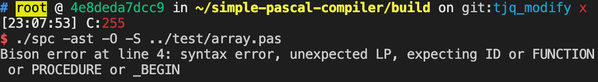

# 测试

我们采用了瀑布开发的开发模型，根据瀑布模型我们进行了六个阶段的工作。首先是需求、评审、技术方案设计、开发、测试、上线。

我们进行需求分析的主要依据为"S2021春季编译原理与技术-课程设计.pptx"，在分析过程中，我们提出了方案设计以及组员分工。除了参与系统设计以外，我主要负责的是系统的质量保障部分，即对应于开发完毕后，对软件的测试部分。

## 测试是什么

## 了解系统

* 需求文档
* 系统架构、业务架构、系统设计、模块功能、业务流程、时序图、状态迁移图等 
* 系统周边：本次系统没有依赖的上下游
* 部署

## 测试设计方法

代码结构其实就跟套娃似的。大的套小的。最小的一层自然是*函数*，很多函数聚集起来，就成了一个*功能*，很多功能聚集起来，就成了一个*模块*，很多模块聚集起来，就成了一个*系统*。

在了解完我们的系统之后，就要开始测试了。我在这次的测试中交叉使用了黑盒测试以及白盒测试的方式，分别对系统的功能性和可靠性进行了检验。

从技术上，测试主要是对于系统可靠性进行检验。我们的程序是否有错误检验功能，实现的功能是否可以顺利执行，执行结果是否符合预期等。而从功能上，测试主要是对于我们预期实现功能的复现，保证我们的程序涵盖了需求文档中所有的要求，运行在正确的轨道上。

我们的系统已经部分完成了，那么要如何确定我们系统的功能正确性呢。我做了一份[checklist](https://bytedance.feishu.cn/mindnotes/bmncn4665kO0sJw8knGuRvmhC9d)用以说明此次测试我所关注的要点以及测试结果。在黑盒测试中，我们主要关注于词法分析、语法分析的输出结果，例如，我们的程序在词法分析过程中对于op，关键字等的识别能力，以及在语法分析中能否正确生成程序的ast树。


其次，我们还需聚焦功能上的实现，例如数组、分支、set、结构体的解析情况等。


## 测试过程

首先进行文件的运行, 由于我们是在linux环境下进行生产操作, 因此编译比较复杂, 需要通过makefile文件进行指定链接文件。先通过以下命令构建程序：

```bash
mkdir build # 默认在根目录下
cd build 
cmake .. # 通过写好的cmakelist生成makefile
make
```

然后我们可以得到目标文件spc。因为我们使用的环境比较复杂,因此我们通过docker容器来维持环境的可用性以及确保团队间的协作，如果老师有兴趣想要自己运行一下验证测试结果，请联系我们获取对应环境的docker容器。

在这次的实验中，我们设计了一部分测试用例，放在了`根目录/test`文件夹下。

### 测试用例1

通过编译好的spc文件执行`./spc -S -ast ../test/hello.pas `生成ast.json和hello.s文件

```pascal
{hello.pas}
program prog;
begin
  writeln('hello the world');
end.
```

测试用例分析，先构建了一个简单的测试用用例，在这个测试用例中，我们测试程序的词法分析的词汇表，语法分析生成的ast树以及最后汇编代码的生成。

#### 目标汇编代码

```assembly
	.text
	.file	"main"
	.globl	main
	.p2align	4, 0x90
	.type	main,@function
main:
	.cfi_startproc
	pushq	%rax
	.cfi_def_cfa_offset 16
	leaq	.L__unnamed_1(%rip), %rdi
	xorl	%eax, %eax
	callq	printf@PLT
	leaq	.L__unnamed_2(%rip), %rdi
	xorl	%eax, %eax
	callq	printf@PLT
	xorl	%eax, %eax
	popq	%rcx
	.cfi_def_cfa_offset 8
	retq
.Lfunc_end0:
	.size	main, .Lfunc_end0-main
	.cfi_endproc

	.type	.L__unnamed_1,@object
	.section	.rodata.str1.1,"aMS",@progbits,1
.L__unnamed_1:
	.asciz	"hello the world"
	.size	.L__unnamed_1, 16

	.type	.L__unnamed_2,@object
.L__unnamed_2:
	.asciz	"\n"
	.size	.L__unnamed_2, 2


	.section	".note.GNU-stack","",@progbits

```

我们的目标是进行系统调用，打印"hello the world", 可见代码`	leaq	.L__unnamed_1(%rip), %rdi`将字符串指针压入寄存器中传入，然后进行系统调用`callq	printf@PLT`, 而`.L__unnamed_1`所对应的参数可以在第26行找到，即`.asciz	"hello the world"`。可以注意到的是这里程序进行了两次print 系统调用，第二次的打印内容可以看到为`.asciz	"\n"`, 即在进行打印以后自动换行，符合预期。

#### 目标AST树

生成的ast树以json形式表现

```json
{
    "type": "Program",
    "name": {
        "type": "Identifier",
        "name": "prog"
    },
    "head": {
        "type": "HeadList",
        "consts": {
            "type": "ConstList",
            "children": []
        },
        "types": {
            "type": "TypeList",
            "children": []
        },
        "vars": {
            "type": "VarList",
            "children": []
        },
        "subroutines": {
            "type": "SubroutineList",
            "children": []
        }
    },
    "children": [
        {
            "type": "ProcStmt",
            "call": {
                "type": "SysCall",
                "identifier": "writeln",
                "args": ){
                    "type": "ArgList",
                    "children": [
                        {
                            "type": "String",
                            "value": "hello the world"
                        }
                    ]
                }
            }
        }
    ]
}

从ast树可见，我们的程序顺利执行了词法分析，将hello.pas中的关键字完好的分离出来，并且基础的语法分析执行正常。

​```json
"head": {
        "type": "HeadList",
        "consts": {
            "type": "ConstList",
            "children": []
        },
        "types": {
            "type": "TypeList",
            "children": []
        },
        "vars": {
            "type": "VarList",
            "children": []
        },
        "subroutines": {
            "type": "SubroutineList",
            "children": []
        }
    }
```

这部分主要进行头部定义，但因为我们没有额外定义变量等参数，因此都为空，符合预期。

```json
"children": [
        {
            "type": "ProcStmt",
            "call": {
                "type": "SysCall",
                "identifier": "writeln",
                "args": {
                    "type": "ArgList",
                    "children": [
                        {
                            "type": "String",
                            "value": "hello the world"
                        }
                    ]
                }
            }
        }
    ]
```

这部分是函数调用部分。按照我们的设计，每一个调用的子函数都会在这里以一个数组元素的形式展现信息。在`hello.pas`中我们调用了`writeln`函数, 由语法树的形式可见, 我们所生成的函数调用类型`SysCall`, 标识符为`writeln`，再向下的类型为传入参数，且类型和值在语法树中都非常明确，显然符合预期。


### 测试用例2

```pascal
program prog;
var nums:array[1..10] of integer;i:integer;x:integer;
function partion(low:integer;high:integer):integer;
    var pivot:integer;i:integer;j:integer;temp:integer;
    begin
        pivot:=nums[high];
        i:=low-1;
        j:=low;
        repeat
            if nums[j] < pivot then begin
                i:=i+1;
                temp:=nums[i];
                nums[i]:=nums[j];
                nums[j]:=temp;
            end;
            j:=j+1;
        until j >= high;
        temp:=nums[i+1];
        nums[i+1]:=nums[high];
        nums[high]:=temp;
        partion:=i+1;
    end;
procedure quickSort(low:integer;high:integer);
    var mid:integer;
    begin
        if low < high then begin
            mid:=partion(low,high);
            quickSort(low,mid-1);
            quickSort(mid+1,high);
        end;
    end;
begin
    for i:=1 to 10 do begin
        readln(x);
        nums[i]:=x;
        
    end;
    writeln('Echo');
    for i:=1 to 10 do begin
        writeln(nums[i]);
    end;
    writeln('Start to sort');
    quickSort(1,10);
    for i:=1 to 10 do begin
        writeln(nums[i]);
    end;
end.

```

这是用pascal实现的一份快排序代码，这个样例主要设计来用于测试分析函数调用、过程调用以及分支指令, 同时，验证一下我们设计的编译器是否能正确处理数组结构。

#### 目标汇编代码

生成过长，详情请见`根目录/build/quitSort.s`，这里仅截出过程调用`quicksort`部分进行分析。

```assembly
quicksort:
	.cfi_startproc
	pushq	%rbp
	.cfi_def_cfa_offset 16
	pushq	%r14
	.cfi_def_cfa_offset 24
	pushq	%rbx
	.cfi_def_cfa_offset 32
	.cfi_offset %rbx, -32
	.cfi_offset %r14, -24
	.cfi_offset %rbp, -16
	cmpl	%esi, %edi
	jge	.LBB1_6
	movl	%esi, %r14d
	movslq	%esi, %r8
	leaq	nums(%rip), %rcx
	movl	-4(%rcx,%r8,4), %r9d
	leal	-1(%rdi), %ebx
	movslq	%edi, %rsi
	jmp	.LBB1_2
	.p2align	4, 0x90
.LBB1_4:
	incq	%rsi
	cmpl	%r14d, %esi
	jge	.LBB1_5
.LBB1_2:
	movl	-4(%rcx,%rsi,4), %eax
	cmpl	%r9d, %eax
	jge	.LBB1_4
	incl	%ebx
	movslq	%ebx, %rbp
	movl	-4(%rcx,%rbp,4), %edx
	movl	%eax, -4(%rcx,%rbp,4)
	movl	%edx, -4(%rcx,%rsi,4)
	jmp	.LBB1_4
.LBB1_5:
	leal	1(%rbx), %eax
	cltq
	movl	-4(%rcx,%rax,4), %edx
	movl	-4(%rcx,%r8,4), %esi
	movl	%esi, -4(%rcx,%rax,4)
	movl	%edx, -4(%rcx,%r8,4)
	movl	%ebx, %esi
	callq	quicksort@PLT
	addl	$2, %ebx
	movl	%ebx, %edi
	movl	%r14d, %esi
	callq	quicksort@PLT
.LBB1_6:
	popq	%rbx
	.cfi_def_cfa_offset 24
	popq	%r14
	.cfi_def_cfa_offset 16
	popq	%rbp
	.cfi_def_cfa_offset 8
	retq
.Lfunc_end1:
	.size	quicksort, .Lfunc_end1-quicksort
	.cfi_endproc
```

对于过程调用quikSort，首先从一个很标志性的地方分析生成的分支、循环调用：

```assembly
	movslq	%edi, %rsi
	jmp	.LBB1_2
	.p2align	4, 0x90
.LBB1_4:
	incq	%rsi
	cmpl	%r14d, %esi
	jge	.LBB1_5
.LBB1_2:
	movl	-4(%rcx,%rsi,4), %eax
	cmpl	%r9d, %eax
	jge	.LBB1_4
	incl	%ebx
	movslq	%ebx, %rbp
	movl	-4(%rcx,%rbp,4), %edx
	movl	%eax, -4(%rcx,%rbp,4)
	movl	%edx, -4(%rcx,%rsi,4)
	jmp	.LBB1_4
```

代码运行至`jmp	.LBB1_2`后先无条件跳转到`.LBB1_2`, 然后在`1.cmpl	%r9d, %eax ` `2. jge	.LBB1_4`处执行值的大小判断和跳转，可见我们的编译器生成了一个很漂亮的for循环语句，nice job！至此，分支、循环功能得到了完美的验证。

#### 目标AST树

生成文件过长，详情请见`根目录/build/quitSort.json`，这里仅截出关键部分进行分析。

生成的AST树应该是纯json格式，在测试中，我发现生成的格式中偶有出现字符引号和括号的丢失或重复，举例如下：

Eg1:

```json
{
    "type": "ProcStmt",
    "call": {
        "type": "SysCall",
        "identifier": "writeln",
        "args": ){
            "type": "ArgList",
            "children": [
                {
                    "type": "String",
                    "value": "Start to sort"
                }
            ]
        }
    }
}
```

Eg2:

```json
"type": Subroutine", 
```

由设计方案分析，我们在设计类的时候，对于每种类型的节点继承了生成json的虚函数，应该是在派生ast节点时，所设计的`json_head()`方法时有缺失，因此返回到ast_node.h文件中，找到关于子过程语义节点的派生类如下（当然，实际的查找定位过程要复杂一些，按下不表）：

```c++
struct SubroutineNode : public RoutineNode
    {
    public:
        std::shared_ptr<ParamListNode> params;
        std::shared_ptr<TypeNode> return_type;

        SubroutineNode(const NodePtr &name, const NodePtr &params, const NodePtr &type, const NodePtr &head_list)
                : RoutineNode(name, head_list), params(cast_node<ParamListNode>(params)),
                  return_type(cast_node<TypeNode>(type))
        {
            assert(is_a_ptr_of<SimpleTypeNode>(type) || is_a_ptr_of<AliasTypeNode>(type));
        }

        llvm::Value *codegen(CodegenContext &context) override;

    protected:
        std::string json_head() const override
        {
            return std::string{"\"type\": Subroutine\", \"name\": "} +
                   this->name->to_json() +
                   ", \"params\": " +
                   this->params->to_json() +
                   ", \"return\": " +
                   this->return_type->to_json() +
                   ", \"head\": " +
                   this->head_list->to_json();
        }
    };
```

可见在重写虚方法`json_head()`时缺少转义字符`\"`。修复后代码如下：

```c++
std::string json_head() const override
        {
            return std::string{"\"type\": \"Subroutine\", \"name\": "} +
                   this->name->to_json() +
                   ", \"params\": " +
                   this->params->to_json() +
                   ", \"return\": " +
                   this->return_type->to_json() +
                   ", \"head\": " +
                   this->head_list->to_json();
        }
```

（ps：eg1和eg2虽然体现的形式不相同，但归因后同源，因此略过eg1的分析、修复过程。）

### 测试用例3

```pascal
{数组测试样例}
program prog;
var
   n: array [1..10] of integer;   (* n is an array of 10 integers*)
   nums:array[1..10] of integer;
   i, j: integer;

begin
   (* initialize elements of array n to 0 *)        
   for i := 1 to 10 do
       n[ i ] := i + 100;   (* set element at location i to i + 100 *)
    (* output each array element's value *)
   
   for j:= 1 to 10 do
      writeln('Element[', j, '] = ', n[j] );
end.
```

在生成时触发了我们的报警机制（也算是测试了一下警报的情况）。如图：



经过排查后发现，我们的编译器在处理注释时有问题，pascal有两种类型的注释，分别为`{}`和`(* *)`, 在最开始的时候我们未考虑第二种类型的注释方式，因此触发了错误处理。

我们是通过正则表达式直接匹配，错误代码如下：

```regrex
"{"   {
    int c;
    while ((c = yyinput())) {
        if (c == '}') break;
        else if (c == '*') {
            if ((c = yyinput()) == ')') {
                break;
            } else {
                unput(c);
            }
        } else if (c == '\n') line_no++;
        else if (c == 0) commenteof();
    }
}
```

更正后有代码如下

```
"{"|"(*"    {
    int c;
    while ((c = yyinput())) {
        if (c == '}') break;
        else if (c == '*') {
            if ((c = yyinput()) == ')') {
                break;
            } else {
                unput(c);
            }
        } else if (c == '\n') line_no++;
        else if (c == 0) commenteof();
    }
}
```


